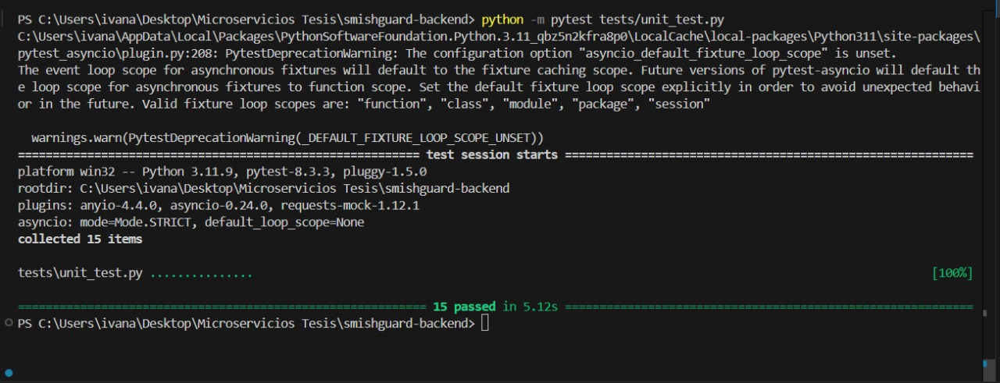
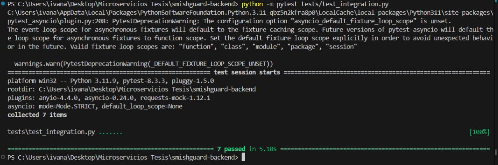
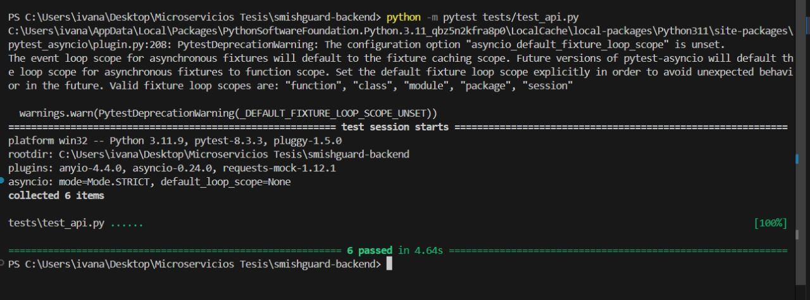
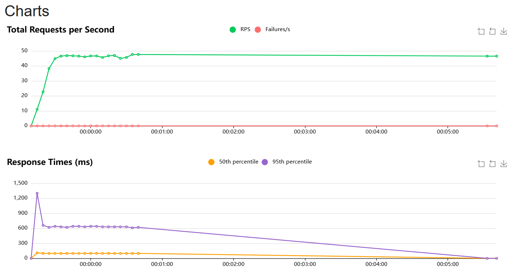
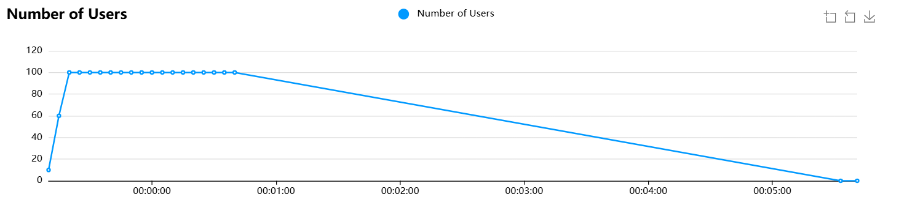

# Backend - SmishGuard

## Descripción

Este servicio proporciona una API para analizar mensajes y evaluar su potencial de phishing o autenticidad. Utiliza modelos de lenguaje y otros microservicios para identificar amenazas de phishing y verificar la legitimidad de mensajes. Este servicio se conecta a una base de datos MongoDB para almacenar análisis previos y está desplegado en **Render**.

## Endpoints

### 1. `GET /`

#### Descripción
Endpoint básico para verificar que el servicio esté funcionando.

#### Respuesta
```json
"hello, world!"
```

### 2. `GET /ping`

#### Descripción
Endpoint de prueba para verificar la disponibilidad de la API.

#### Respuesta
```json
{
    "message": "pong"
}
```

### 3. `POST /consultar-modelo`

#### Descripción
Analiza un mensaje para identificar si es peligroso, sospechoso o seguro, utilizando varios criterios de seguridad. Este análisis se hace combinando resultados de otros microservicios y modelos.

#### Solicitud
- URL: `/consultar-modelo`
- Método: `POST`
- Body: JSON con los campos `mensaje` y opcionalmente `numero_celular`.

```json
{
    "mensaje": "Texto del mensaje a analizar",
    "numero_celular": "+123456789"
}
```

#### Respuesta
Un JSON que contiene el análisis y puntaje de riesgo del mensaje.

```json
{
    "analisis_gpt": "Conclusión de seguridad del mensaje",
    "analisis_smishguard": "Seguro | Sospechoso | Peligroso",
    "enlace": "URL analizada",
    "resultado_url": "Seguro | Malicioso | Indeterminado",
    "resultado_ml": "No Spam | Spam",
    "mensaje_analizado": "Texto del mensaje",
    "numero_celular": "+123456789",
    "puntaje": 7
}
```

#### Errores
Si el campo `mensaje` está vacío o no se incluye:

```json
{
    "error": "El campo 'mensaje' es obligatorio."
}
```
### 4. `GET /mensajes-para-publicar`

#### Descripción
Obtiene mensajes que no han sido publicados.

#### Respuesta
```json
{
    "documentos": [
        {
            "_id": "ObjectId",
            "contenido": "Contenido del mensaje",
            ...
        }
    ]
}
```

### 5. `POST /guardar-mensaje-para-publicar`

#### Descripción
Guarda un mensaje para su posterior publicación.

#### Solicitud
- URL: `/guardar-mensaje-para-publicar`
- Método: `POST`
- Body: JSON con los campos `contenido`, `url`, `analisis` y `publicado`.

```json
{
    "contenido": "Contenido del mensaje",
    "url": "URL asociada",
    "analisis": {
        "calificacion_gpt": 0.5,
        "nivel_peligro": "Sospechoso"
    },
    "publicado": false
}
```

#### Respuesta
```json
{
    "mensaje": "El mensaje reportado se ha guardado exitosamente."
}
```

### 6. `PUT /actualizar-publicado/<mensaje_id>`

#### Descripción
Actualiza el estado de publicación de un mensaje.

#### Respuesta
```json
{
    "mensaje": "El estado de 'publicado' ha sido actualizado exitosamente."
}
```

### 7. `DELETE /eliminar-mensaje-para-publicar/<mensaje_id>`

#### Descripción
Elimina un mensaje específico de la base de datos.

#### Respuesta
```json
{
    "mensaje": "El mensaje ha sido eliminado exitosamente."
}
```

### 8. `POST /publicar-tweet`

#### Descripción
Publica un mensaje en Twitter utilizando otro microservicio.

#### Solicitud
- URL: `/publicar-tweet`
- Método: `POST`
- Body: JSON con el campo `mensaje`.

```json
{
    "mensaje": "Mensaje a publicar en Twitter"
}
```

#### Respuesta
```json
{
    "mensaje": "Tweet publicado exitosamente",
    "ResultadoTwitter": "Respuesta del servicio de Twitter"
}
```

### 9. `POST /comentario-soporte`

#### Descripción
Guarda un comentario de soporte proporcionado por el usuario.

#### Solicitud
- URL: `/comentario-soporte`
- Método: `POST`
- Body: JSON con los campos `comentario` y `correo`.

```json
{
    "comentario": "Texto del comentario",
    "correo": "correo@ejemplo.com"
}
```

#### Respuesta
```json
{
    "mensaje": "Comentario guardado exitosamente."
}
```

### 10. `GET /comentario-soporte`

#### Descripción
Obtiene todos los comentarios de soporte.

#### Respuesta
```json
{
    "comentarios": [
        {
            "_id": "ObjectId",
            "comentario": "Texto del comentario",
            "correo": "correo@ejemplo.com",
            ...
        }
    ]
}
```

### 11. `DELETE /eliminar-comentario-soporte/<comentario_id>`

#### Descripción
Elimina un comentario de soporte específico.

#### Respuesta
```json
{
    "mensaje": "El comentario ha sido eliminado exitosamente."
}
```

### 12. `POST /historial-analisis-usuarios`

#### Descripción
Guarda un historial de análisis de mensajes reportados por el usuario.

#### Solicitud
- URL: `/historial-analisis-usuarios`
- Método: `POST`
- Body: JSON con los campos `mensaje`, `url`, `analisis`, `correo` y `numero_celular`.

```json
{
    "mensaje": "Mensaje analizado",
    "url": "URL analizada",
    "analisis": {...},
    "correo": "correo@ejemplo.com",
    "numero_celular": "+123456789"
}
```

#### Respuesta
```json
{
    "mensaje": "Historial de mensaje reportado guardado exitosamente."
}
```

### 13. `GET /historial-analisis-usuarios/<correo>`

#### Descripción
Obtiene el historial de análisis de mensajes reportados por el correo del usuario.

#### Respuesta
```json
{
    "historial": [
        {
            "_id": "ObjectId",
            "mensaje": "Mensaje analizado",
            "analisis": {...},
            ...
        }
    ]
}
```

### 14. `POST /numeros-bloqueados`

#### Descripción
Guarda un número de teléfono bloqueado por el usuario.

#### Solicitud
- URL: `/numeros-bloqueados`
- Método: `POST`
- Body: JSON con los campos `numero` y `correo`.

```json
{
    "numero": "+123456789",
    "correo": "correo@ejemplo.com"
}
```

#### Respuesta
```json
{
    "mensaje": "Número bloqueado guardado exitosamente."
}
```

### 15. `GET /numeros-bloqueados/<correo>`

#### Descripción
Obtiene la lista de números bloqueados por el usuario identificado por su correo.

#### Respuesta
```json
{
    "numeros": [
        {
            "_id": "ObjectId",
            "numero": "+123456789",
            ...
        }
    ]
}
```

### 16. `DELETE /historial-analisis-usuarios/<id>`

#### Descripción
Elimina un historial de mensaje reportado.

#### Respuesta
```json
{
    "mensaje": "Historial eliminado exitosamente"
}
```

### 17. `DELETE /numeros-bloqueados/<correo>/<numero>`

#### Descripción
Elimina un número bloqueado específico para el correo proporcionado.

#### Respuesta
```json
{
    "mensaje": "Número bloqueado eliminado exitosamente"
}
```

### 18. `GET /mensaje-aleatorio`

#### Descripción
Obtiene un mensaje aleatorio de la colección.

#### Respuesta
```json
{
    "mensaje": {
        "_id": "ObjectId",
        "contenido": "Mensaje aleatorio",
        ...
    }
}
```

### 19. `GET /estadisticas`

#### Descripción
Obtiene estadísticas generales sobre los mensajes analizados y los mensajes pendientes de publicación.

#### Respuesta
```json
{
    "mensajes": {
        "total_analizados": 100,
        "seguros": 50,
        "sospechosos": 30,
        "peligrosos": 20
    },
    "mensajes_para_publicar": {
        "total": 10,
        "publicados": 5,
        "no_publicados": 5
    }
}
```

## Pruebas y Resultados

### Pruebas Unitarias
Se realizaron pruebas unitarias para cada función individual del servicio utilizando pytest. Todas las pruebas unitarias pasaron correctamente, como se muestra en el resultado:



### Pruebas de Integración
Se llevaron a cabo pruebas de integración para verificar la interacción entre múltiples servicios y microservicios. Todas las pruebas de integración también pasaron exitosamente:



### Pruebas de la API
Las pruebas de la API confirmaron que todos los endpoints funcionan correctamente y responden con el formato JSON esperado:



### Pruebas de Carga
Se realizaron pruebas de carga utilizando Locust para simular múltiples usuarios concurrentes accediendo a la API. Los resultados mostraron que el servicio puede manejar la carga esperada sin tiempos de respuesta excesivos.




## Instalación y Ejecución Local

1. Clona el repositorio.

```bash
git clone <URL_del_repositorio>
cd <nombre_del_directorio>
```

2. Instala las dependencias necesarias.

```bash
pip install -r requirements.txt
```

3. Configura las variables de entorno en un archivo `.env` con las credenciales de MongoDB.

4. Ejecuta la aplicación.

```bash
python app.py
```

La API estará disponible en `http://127.0.0.1:5000`.

## Licencia

Este proyecto está licenciado bajo la MIT License.


